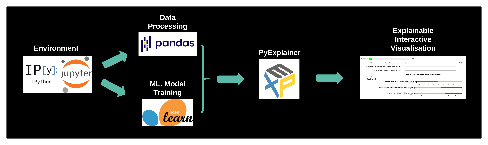

# pyexplainer 
[](https://codecov.io/gh/awsm-research/pyExplainer)
[](https://pyexplainer.readthedocs.io/en/latest/?badge=latest)
[](https://badge.fury.io/py/pyexplainer)
[](https://lgtm.com/projects/g/awsm-research/pyExplainer/context:python)
[](https://lgtm.com/projects/g/awsm-research/pyExplainer/context:javascript)
[](https://mybinder.org/v2/gh/MichaelFu1998-create/pyexplainer_notebook.git/HEAD)

pyexplainer is a python package that generates explainable Machine Learning predictions from the so-called 'black-box model' such as random forest, moreover, pyexplainer provides interactive visualisation that simplifies the decision-making process for Software Engineering.

Here is a snapshot of how it works



## Table Of Contents

* **[How to cite pyexplainer](#how-to-cite-pyexplainer)**
* **[Dependencies](#dependencies)**
* **[Installation](#installation)**
* **[Source Code](#source-code)**
* **[Tutorial](#tutorial)**
* **[Contributors](#contributors)**
* **[Documentation](#documentation)**
* **[License](#license)**
* **[Credits](#credits)**

## How to cite pyexplainer

- todo

## Dependencies

- python = "3.8"
- scikit-learn = "0.24.1"
- numpy = "1.20.1"
- scipy = "1.6.1"
- ipywidgets = "7.6.3"
- ipython = "7.21.0"
- pandas = "1.2.3"

The list of dependencies is shown upder [pyproject.toml file](https://github.com/awsm-research/pyExplainer/blob/master/pyproject.toml), however the installer takes care of installing them for you.

## Installation

Installing pyexplainer is easily done using pip, simply run the following:

```bash 
$ pip install pyexplainer
```
This will also install the necessary dependencies.

For more approaches to install, please click [here](https://pyexplainer.readthedocs.io/en/latest/installation.html)

## Source Code

If you'd like to clone from source, you can do it in two simple steps as follows:

```
> git clone https://github.com/awsm-research/pyExplainer.git
> cd pyExplainer
```

## Tutorial

For information on how to use pyexplainer, refer to the official documentation:
- [Tutorial Video](https://www.youtube.com/watch?v=p6uff4iYtHo)

[](https://www.youtube.com/watch?v=p6uff4iYtHo "Tutorial")
- [Quickstart Notebook](https://github.com/awsm-research/pyExplainer/blob/master/quickstart_guide/formal_quickstart.ipynb)
- [Official Documentation](https://pyexplainer.readthedocs.io/en/latest/)


## Contributors

We welcome and recognize all contributions. You can see a list of current contributors in the [contributors tab](https://github.com/awsm-research/pyExplainer/graphs/contributors).

Please click [here](https://pyexplainer.readthedocs.io/en/latest/contributing.html) to gain more information about making a contribution to this project.

## Documentation

The official documentation is hosted on [Read the Docs](https://pyexplainer.readthedocs.io/en/latest/)

## License

MIT License, click [here](https://github.com/awsm-research/pyExplainer/blob/master/LICENSE) for more information.

### Credits

This package was created with Cookiecutter and the UBC-MDS/cookiecutter-ubc-mds project template, modified from the [pyOpenSci/cookiecutter-pyopensci](https://github.com/pyOpenSci/cookiecutter-pyopensci) project template and the [audreyr/cookiecutter-pypackage](https://github.com/audreyr/cookiecutter-pypackage).
